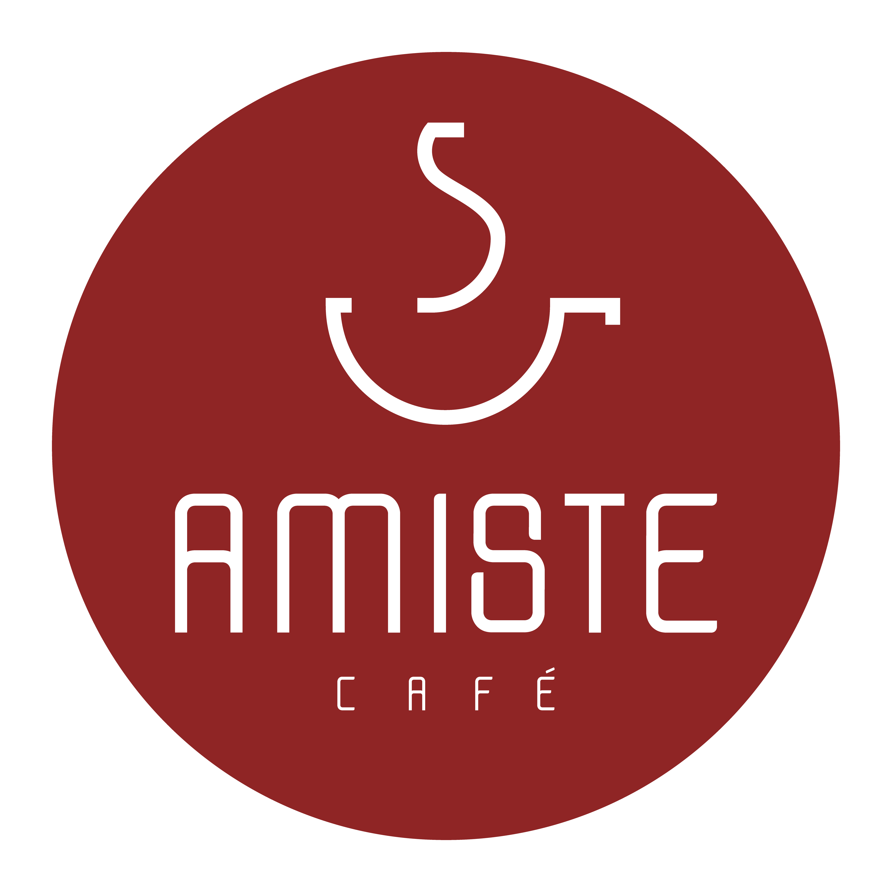
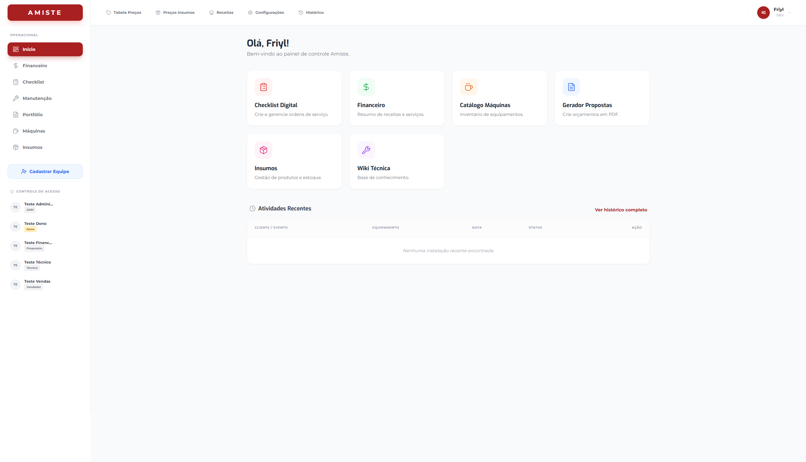

# ☕ Sistema de Gestão Amiste Café

<div align="center">
  
  <br />
  
  <h3>Gestão Comercial e Operacional Unificada</h3>

  <p>
    <a href="https://amistecafe.com.br/">🌐 Site Oficial Amiste</a> • 
    <a href="https://amiste-projeto.vercel.app/">🚀 Demonstração Online</a>
  </p>
</div>

---

## 📸 Visão Geral



> _Nota: Se a imagem acima não carregar, certifique-se de adicionar o arquivo na pasta correta._

---

## 💡 Sobre o Projeto

O **Sistema Amiste** é uma aplicação Full Stack desenvolvida para digitalizar e otimizar os processos internos da **Amiste Café**. O sistema atua como um hub central, eliminando processos manuais e planilhas desconexas, conectando o setor **Comercial** (vendas e propostas) ao setor **Técnico** (instalação e manutenção).

### 🎯 De onde veio a ideia?

A necessidade surgiu da observação de gargalos operacionais diários. A equipe comercial perdia tempo formatando propostas manuais e buscando fotos de máquinas, enquanto a equipe técnica precisava de checklists mais dinâmicos que se adaptassem às especificidades de cada instalação (ponto de água, esgoto, voltagem).

O objetivo foi criar uma ferramenta única, intuitiva e acessível via web, capaz de gerar documentos profissionais automaticamente e manter o histórico de operações.

---

## 🚀 Funcionalidades Principais

### 1. Catálogo de Máquinas Inteligente

- Cadastro detalhado com especificações técnicas (peso, voltagem, dimensões).
- **Sistema de Herança (Parent/Child):** Suporte para máquinas com múltiplas variações (ex: modelos de 2L, 6L, 15L) que herdam dados do pai ou sobrescrevem especificações únicas.
- Gestão de fotos e vídeos demonstrativos.

### 2. Gerador de Portfólio (Propostas)

- Criação de propostas comerciais em tempo real.
- **Geração de PDF no Frontend:** Utiliza `@react-pdf/renderer` para montar documentos prontos para envio.
- Cálculo automático de parcelas e valores.
- _Feature Técnica:_ Conversão automática de imagens externas para Base64 (com Proxy) para evitar bloqueios de CORS nos navegadores.

### 3. Checklist Técnico Operacional

- Listas de verificação dinâmicas para instalação e manutenção.
- Cálculo automático de ferramentas necessárias baseado na infraestrutura do local (ex: se tem rede hídrica, solicita peças específicas).
- Assinatura digital e validação de etapas.

### 4. Módulo Financeiro & Insumos

- Tabelas de preços atualizáveis com controle de permissão.
- Gestão de insumos, receitas e custos.
- Dashboard financeiro com previsões de vendas e serviços realizados.

### 5. Segurança e Controle de Acesso (RBAC)

- Sistema robusto de permissões. O que cada usuário vê depende do seu cargo:
  - **DEV/Dono:** Acesso total.
  - **Comercial:** Acesso a propostas e clientes.
  - **Técnico:** Acesso a checklists, configurações de máquinas e Wiki.

---

## 🛠️ Tecnologias Utilizadas

O projeto foi construído utilizando as tecnologias mais modernas do ecossistema React.

### Frontend

- **React.js (Vite):** Performance e agilidade no desenvolvimento.
- **TailwindCSS:** Estilização responsiva e design system consistente.
- **React Router v6:** Roteamento e proteção de rotas privadas.
- **Lucide React:** Iconografia leve e moderna.
- **@react-pdf/renderer:** Motor de geração de PDFs dinâmicos.

### Backend & Infraestrutura (BaaS)

- **Supabase:**
  - **PostgreSQL:** Banco de dados relacional robusto.
  - **Authentication:** Gestão de usuários e sessões.
  - **Storage:** Armazenamento de imagens das máquinas.
  - **Row Level Security (RLS):** Segurança a nível de banco de dados.

---

## ⚙️ Instalação e Execução

Para rodar este projeto localmente:

1. **Clone o repositório:**
   ```bash
   git clone [https://github.com/SEU-USUARIO/sistema-amiste.git](https://github.com/SEU-USUARIO/sistema-amiste.git)
   cd sistema-amiste
   ```
